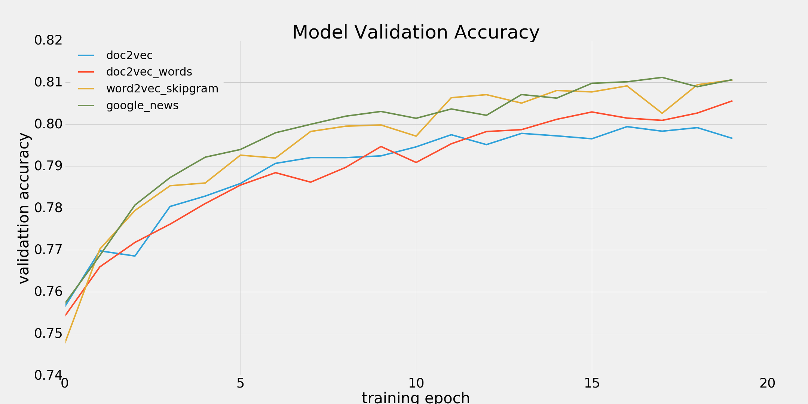

# Quora-DupQ-with-Gensim
Exploring Quora duplicate question classification task with Gensim and Keras

This little repo contains two ipython notebooks that use python to explore the Quora duplicate questions dataset, which can be found here: https://blog.quora.com/Quality-and-Duplicate-Questions

The task in this dataset is to determine whether a pair of questions are duplicates of each other.

## Quora Questions - Bag-of-Words and Word2Vec Averaging

This notebook is a simple exploration of the dataset and shows the first steps one might take when looking at new data (which include literally looking at data, checking for null values, cleaning data, etc). The notebook also shows a little machine learning with tf-idf vectors, though the second notebook is heavier on the machine learning.

## Quora Duplicate Questions with Word2vec and Keras

This notebook uses word and document vectors to represent the questions, then puts these vector representations into a neural network for the classification task. The notebook is almost totally self-contained, i.e. its cells can be run in succession and they will automatically download the required data, clean it, and do machine learning. (This notebook makes reference to the quora_dup_utils.py file for helper functions.) As the title suggests, the notebook uses the gensim and keras python libraries. 

The approach taken was to use a single neural network architecture and compare the results between four different types of question vector representations. The four types are standard doc2vec, averages of word vectors calculated when doc2vec trained, averages of skip-gram word vectors, and averages of Google News pre-trained word vectors. (See https://radimrehurek.com/gensim/models/doc2vec.html and elsewhere for material about word2vec, doc2vec etc. Google News pretrained word vectors can be found here: https://code.google.com/archive/p/word2vec/. The doc2vec model was trained using optimization advice from this paper: https://arxiv.org/pdf/1607.05368.pdf)

### Results: which vector representation worked best for this task?

The same neural network was trained using four different vector representations for the questions as input. 

The results are summarized in this graph showing cross-validated loss vs training epoch: 

