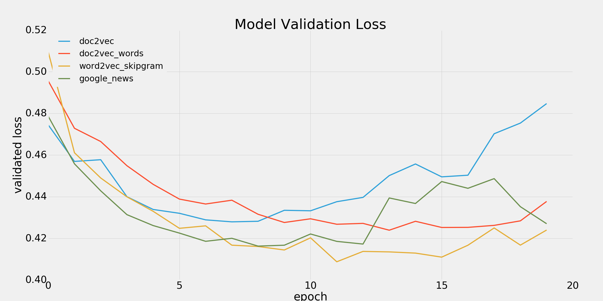

# Quora-DupQ-with-Gensim
Exploring Quora duplicate question classification task with Gensim and Keras

This little repo contains two ipython notebooks that use python to explore the Quora duplicate questions dataset, which can be found here: https://blog.quora.com/Quality-and-Duplicate-Questions

The task in this dataset is to determine whether a pair of questions are duplicates of each other.

## Quora Questions - Bag-of-Words and Word2Vec Averaging

This notebook is a simple exploration of the dataset and shows the first steps one might take when looking at new data (which include literally looking at data, checking for null values, cleaning data, etc). The notebook also shows a little machine learning with tf-idf vectors, though the second notebook is heavier on the machine learning.

## Quora Duplicate Questions with Word2vec and Keras

This notebook uses word and document vectors to represent the questions, then puts these vector representations into a neural network for the classification task. The notebook is almost totally self-contained, i.e. its cells can be run in succession and they will automatically download the required data, clean it, and do machine learning. (This notebook makes reference to the quora_dup_utils.py file for helper functions.) As the title suggests, the notebook uses the gensim and keras python libraries. 

The approach taken was to use a single neural network architecture and compare the results between four different types of question vector representations. The four types are standard doc2vec, averages of word vectors calculated when doc2vec trained, averages of skip-gram word vectors, and averages of Google News pre-trained word vectors. (See https://radimrehurek.com/gensim/models/doc2vec.html and elsewhere for material about word2vec, doc2vec etc. Google News pretrained word vectors can be found here: https://code.google.com/archive/p/word2vec/. The doc2vec model was trained using optimization advice from this paper: https://arxiv.org/pdf/1607.05368.pdf)

### Results: which vector representation worked best for this task?

The same neural network was trained using four different vector representations for the questions as input. 

The results are summarized in this graph showing cross-validated accuracy vs training epoch: 

and this similar graph showing cross-validated loss vs training epoch: 

Overall the four models perform within a percentage point or so of each other, though at the state-of-the-art these percentage points can matter. (To be clear, the results shown here are by no means state-of-the-art!)

We see that somewhat surprisingly, the doc2vec model performs the worst of the four - this may be because the doc2vec model implicitly must use word2vec vectors trained on the training data, and the Quora duplicate question data set may not be large or general enough to get reliable word vectors trained. 

The two best-performing vector representations for this task were <b>skip-gram word2vec</b> and <b>Google News</b>. The Google News result is most interesting because the Google News vectors are entirely pretrained from ~30 GB of Google News data - the training didn't involved a question task at all. This suggests that for a data set of this size (~400,000 sentences) well-formed word vectors are more important that the domain-specificity that may be gained by training the word vectors on the specific data being used in the task. Based on these results, for this task the skip-gram word2vec appraoch works better than the cbow appraoch (see original word2vec paper: https://papers.nips.cc/paper/5021-distributed-representations-of-words-and-phrases-and-their-compositionality.pdf and others: https://blog.acolyer.org/2016/04/21/the-amazing-power-of-word-vectors/)

The graphs above also suggest more clarity may be gained by training the neural network for more epochs - there is a hint that the accuracy may continue to rise for some of the models. 

### Summary of classifier evaluation metrics for each vector representation

#### Doc2vec model:
Accuracy: 0.7966  
Precision: 0.717  
Recall: 0.7408  
F1: 0.7287  

#### Doc2vec word-average model:
Accuracy: 0.8056  
Precision: 0.7487  
Recall: 0.7115  
F1: 0.7296  

#### Skip-gram Word2vec model:
Accuracy: 0.8106  
Precision: 0.7364  
Recall: 0.7573  
F1: 0.7467  

#### Google News model:
Accuracy: 0.8106  
Precision: 0.7347  
Recall: 0.7613  
F1: 0.7478  

